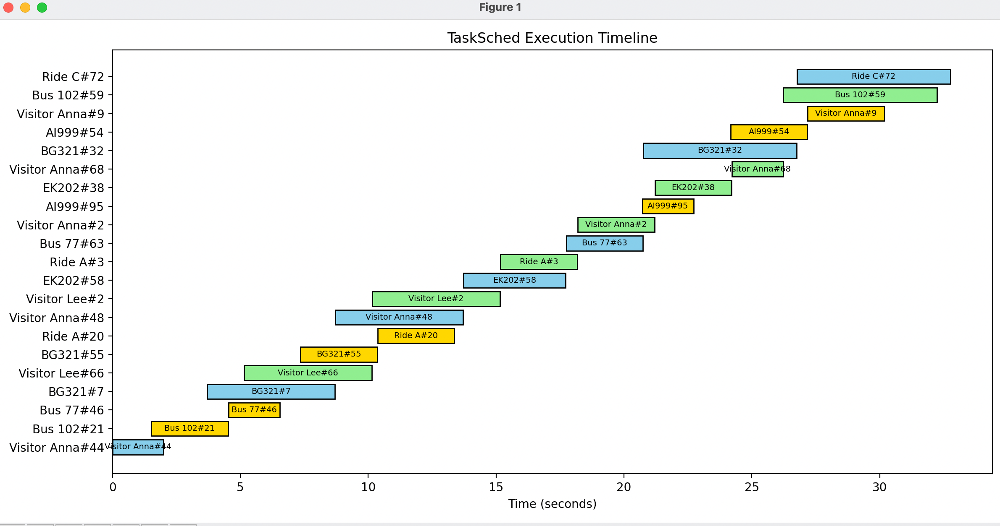

# TaskSched - Multithreaded OS Scheduling Simulator

This project simulates four core CPU scheduling algorithms using Python multithreading and visualizes the task execution timeline with a Gantt chart. It's designed as a practical Operating Systems project to showcase scheduling behaviors and concurrent task handling.

---

## 🧠 Key Features

- 🧵 Multithreading for simulating concurrent systems
- 🗂️ Four CPU Scheduling Algorithms:
  - **Priority Scheduling** (Airport System)
  - **First-Come-First-Serve (FCFS)** (Bus Stop)
  - **Round Robin** with 3s quantum (Amusement Park)
  - **Shortest Job First (SJF)** (Ride Share)
- 📊 Gantt Chart Visualization using `matplotlib`
- 📦 Organized code with classes, queues, and log tracking

---

## 🚀 How to Run

### 🔧 Requirements
- Python 3.x
- `matplotlib` library

Install dependencies:
```bash
pip install matplotlib

OUTPUT:
Random task in 30 sec :
[New Task] Visitor Anna#44(BT=2, P=3) added to airport
[Airport ✈️] Handling Visitor Anna#44(BT=2, P=3)
[New Task] Bus 102#21(BT=3, P=5) added to amusement
[Amusement Park 🎢] Running Bus 102#21 for 3 units
[New Task] Bus 77#46(BT=2, P=2) added to amusement
[New Task] BG321#7(BT=5, P=1) added to airport
[Airport ✈️] Handling BG321#7(BT=5, P=1)
[Amusement Park 🎢] Running Bus 77#46 for 2 units
[New Task] Visitor Lee#66(BT=5, P=5) added to bus
[Bus Stop 🚌] Departing Visitor Lee#66(BT=5, P=5)
[New Task] Visitor Anna#48(BT=5, P=5) added to airport
[New Task] BG321#55(BT=3, P=2) added to amusement
[Amusement Park 🎢] Running BG321#55 for 3 units
[New Task] Ride A#20(BT=3, P=2) added to amusement
[Airport ✈️] Handling Visitor Anna#48(BT=5, P=5)
[New Task] Visitor Lee#2(BT=5, P=5) added to bus
[Bus Stop 🚌] Departing Visitor Lee#2(BT=5, P=5)
[New Task] Ride A#3(BT=3, P=2) added to bus
[Amusement Park 🎢] Running Ride A#20 for 3 units
[New Task] EK202#58(BT=4, P=1) added to airport
[New Task] Visitor Anna#2(BT=3, P=3) added to bus
[Airport ✈️] Handling EK202#58(BT=4, P=1)
[New Task] Bus 77#63(BT=3, P=1) added to airport
[New Task] EK202#38(BT=3, P=3) added to bus
[Bus Stop 🚌] Departing Ride A#3(BT=3, P=2)
[New Task] Visitor Anna#68(BT=2, P=1) added to bus
[New Task] Bus 102#59(BT=6, P=1) added to bus
[New Task] Ride A#75(BT=5, P=4) added to bus
[Airport ✈️] Handling Bus 77#63(BT=3, P=1)
[New Task] BG321#32(BT=6, P=3) added to airport
[Bus Stop 🚌] Departing Visitor Anna#2(BT=3, P=3)
[New Task] Visitor Lee#67(BT=2, P=4) added to bus
[New Task] AI999#95(BT=2, P=5) added to amusement
[Amusement Park 🎢] Running AI999#95 for 2 units
[Airport ✈️] Handling BG321#32(BT=6, P=3)
[Bus Stop 🚌] Departing EK202#38(BT=3, P=3)
[New Task] Bus 77#48(BT=4, P=2) added to airport
[New Task] Ride C#72(BT=6, P=1) added to airport
[New Task] AI999#54(BT=6, P=3) added to amusement
[Amusement Park 🎢] Running AI999#54 for 3 units
[Bus Stop 🚌] Departing Visitor Anna#68(BT=2, P=1)
[New Task] BG321#15(BT=5, P=4) added to airport
[New Task] Visitor Anna#9(BT=4, P=2) added to amusement
[New Task] Bus 77#60(BT=4, P=2) added to bus
[Bus Stop 🚌] Departing Bus 102#59(BT=6, P=1)
[Airport ✈️] Handling Ride C#72(BT=6, P=1)
[Amusement Park 🎢] Running Visitor Anna#9 for 3 units
[New Task] Ride A#14(BT=2, P=3) added to amusement
[New Task] Ride C#99(BT=5, P=1) added to amusement
[New Task] EK202#63(BT=6, P=3) added to airport
✅ Execution finished. Generating Gantt chart...

## 📈 Gantt Chart Output

This chart visualizes task execution order and duration using different CPU scheduling algorithms:

